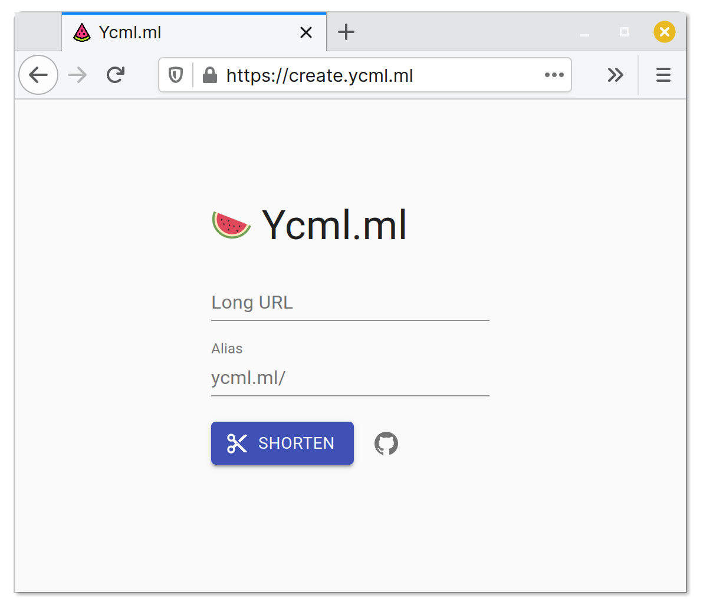

# 🍉 Ycml

[ Site | [API](https://github.com/Ycmelon/ycml-api) ]

Material Design URL shortener with React and Material-UI

## 📷 Screenshots

|                     Light                     |                    Dark                     |
| :-------------------------------------------: | :-----------------------------------------: |
|  |  |

## 📃 License

[GNU General Public License v3.0](https://choosealicense.com/licenses/gpl-3.0/)
